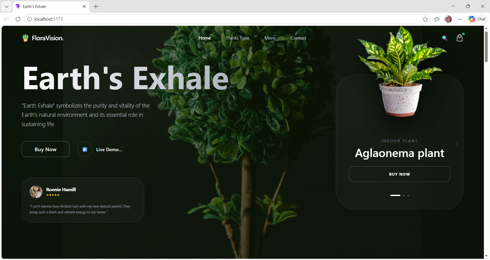
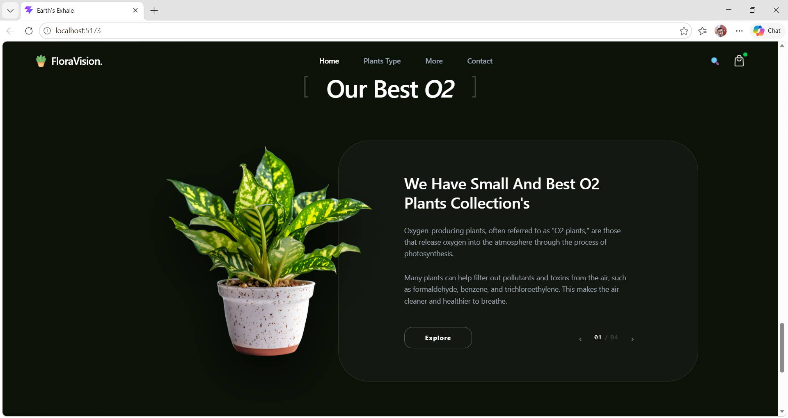

# FloraVision - Landing Page

A high-fidelity, responsive plant shop landing page built as part of the SoftDef Frontend Internship Screening Task.

## Features
- **Modern UI/UX:** Clean design with glassmorphism and smooth animations.
- **Responsive Design:** Optimized for Desktop, Tablet, and Mobile.
- **Dynamic Sections:** Includes Hero, Trending Plants, Top Selling, and Customer Reviews.

##  Tech Stack
- **React.js** (Vite)
- **Tailwind CSS** (Styling)
- **Lucide React** (Icons)
- **Framer Motion** (Animations - optional)

## Installation & Setup

1. **Clone the repository:**
   
   git clone [https://github.com/jaiswal-suraj12/floravision-landing-page.git]

## Install dependencies:
     npm install
## Run the development server:
npm run dev 
## 📸 Screenshots

### Desktop View

### Best O2 Section

